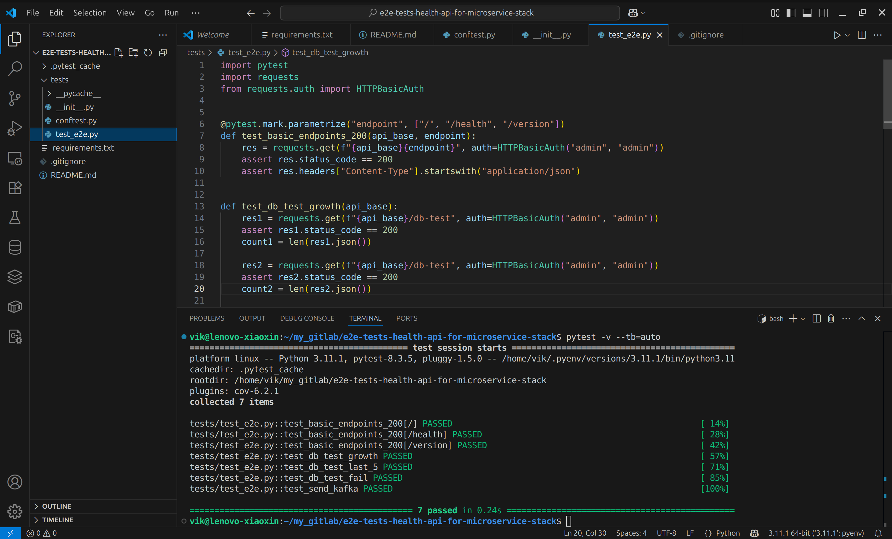

# Оглавление

- [О проекте](#о-проекте)
- [Чек-лист тестов](#чек-лист-тестов)
- [Запуск тестов](#запуск-тестов)
- [Авторизация](#авторизация)
- [Покрытие](#покрытие)
- [Успешный прогон тестов](#успешный-прогон-тестов)

# О проекте

E2E- и API-тесты для микросервиса `health-api` из проекта [health-api-for-microservice-stack](https://githab.com/vikgur/health-api-for-microservice-stack).

Проверяется корректность ответов API, взаимодействие с БД и отправка сообщений в Kafka.

---

## Чек-лист тестов

| Тест                       | Что проверяется                                    | Тип            |
|----------------------------|-----------------------------------------------------|----------------|
| `test_basic_endpoints_200`| Все ручки `/`, `/health`, `/version` отдают `200 OK` и JSON | API     |
| `test_db_test_growth`     | Количество сообщений растёт при каждом вызове      | API + БД       |
| `test_db_test_last_5`     | Возвращаются последние 5 сообщений, структура OK   | API + БД       |
| `test_db_test_fail`       | Возврат 500 при отказе БД (недоступный хост)       | API + отказ    |
| `test_send_kafka`         | Отправка сообщения в Kafka, структура сообщения    | API            |

---

## Запуск тестов

Перед стартом убедитесь, что у вас в докерах локально поднят весь проект [prod-ready-dockerized-microservice-stack](https://githab.com/vikgur/prod-ready-dockerized-microservice-stack)

1. Установить зависимости:

```
pip install -r requirements.txt
```

2. Запустить тесты:

```
pytest -v --tb=auto
```

или запустите тесты с автоматической генерацией и открытием Allure-отчета:

```
pytest --alluredir=allure-results && allure generate allure-results --clean -o allure-report && allure open allure-report
```

По умолчанию тесты используют базовый URL `http://localhost` и авторизацию `admin:admin`.

---

## Авторизация

Все запросы выполняются с HTTP Basic Auth:
```
Логин: admin
Пароль: admin
```

---

## Покрытие

Покрываются:

- Все публичные API ручки
- Взаимодействие с PostgreSQL
- Отправка сообщений в Kafka

Трейсы отправляются через OpenTelemetry (OTLP) и доступны в Jaeger.

---

## Успешный прогон тестов

Ниже — скриншот с успешным запуском всех e2e тестов:



